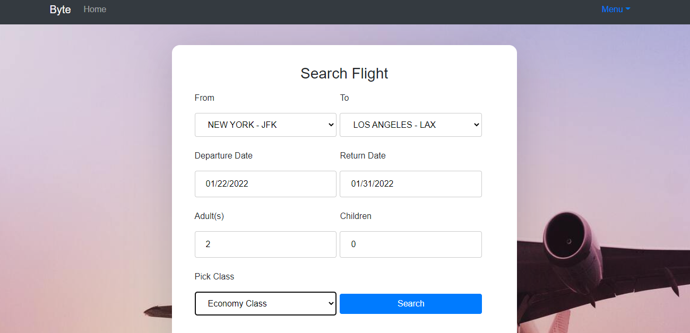
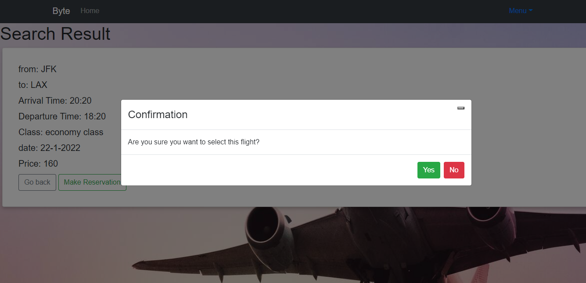

## Byte

Byte is an airline reservation website project made with MERN stack for our Advanced Media Lab course. It include all the basic functionalities where a user can search and select a flight, select wanted seats and proceed to pay for them.

## Motivation

Byte is our Advanced Media Lab Term project. This project allows all participating members to gain experience in coding using MERN stack and create a valid output, which will later be useful in the work field.

This website provides insights and the output should be a fully functioning airline reservation that allows better access to users worldwide to reserve flight tickets online, as well as increase reach of airlines.

## Code style

In this project, standard code style was used. VS Code automatically fixed the spacing, indentation and format.

In most react pages, the imports were placed first, then any variables used, followed by the function. Inside the function, first we declared the consts used, then the useEffect if there is any data taken from the previous page, which is then set into the consts created. Finally, the return which includes the actual frontend is placed.

[](https://github.com/feross/standard)

## Screenshots




## Tech/framework used

**Built with**

- [React](https://reactjs.org/)
- [MongoDB](https://www.mongodb.com/)
- [Express](https://expressjs.com/)
- [NodeJS](https://nodejs.org/en/)

## Features

The website overall has a simple design that allows user to easily navigate through the website to successfully book a flight ticket.

The pages are routed for maximum convenience and comfort of user. In the search page, user doesn't need to memorize airport name since we provide him with the names and locations of available airports.

Also, the seats page allows user to pick seats based on where they are in the actual airplane, increasing user satisfaction.

## Installation

-After cloning the repository, install the dependencies

```bash
npm install
npm i react-router-dom
npm i react-router
npm i react-bootstrap
npm i react-seat-picker
npm i react-stripe-js
npm i react-stripe-checkout
npm i react-datepicker

css:
bootstrap/dist/css/bootstrap.min.css
react-datepicker/dist/react-datepicker.css
```

-To run the Backend server

```bash
npm run server
```

-To run the Frontend server:

```bash
cd myapp
npm start
```

## API Reference

Since this was a simple project, not many APIs were used. The following were used in the project:

1. https://www.npmjs.com/package/react-seat-picker

## Tests

To test the website, we do not use a particular jest algorithm. Instead, we have a walkthrough reflecting the user journey to ensure that there are no problems when the user tries to use the website to search and select a flight, select wanted seats and pays for them.
To login, we test by trying all cases:

1. Inserting correct username and password
2. Inserting incorrect username and/or password

To change password, the following cases are tested:

1. The new passwords don't match, so an error is displayed
2. Incorrect old password is inserted, and error is displayed
3. Correct old password is inserted, and the password is updated to the new version

To signup, the following cases are tested:

1. Signup as an already existing user
2. Signup as an unregistered user, so you're allowed to continue and user is added to
   database

## How to use?

Use login page if you are an already registered user, and signup page otherwise.
Start at the search page (www.localhost:3000 transports you there automatically), and insert the data of the flight you want, including the departure and arrival airports, the departure and returning dates, number of adults and children, as well as the cabin class (First-Business-Economy). Then click search to move to the search flight result. Select the wanted flight and a flight summary will be displayed. If you wish to continue, click on the button to proceed to seat picking. In the seats page, select the wanted seats and the Seat Summary on the right of the page will be updated automatically to show you flight and seat details as well as the total price. Click button to proceed to UserInput page where the user will insert the information of the travelers (full name-passport number-email). Then, move onto Payment page to finalize booking of the seats, and a confirmation email will be sent if the procedure was successful.

## Contribute

To contribute, go to the github [[advanced-computer-lab/Byte]] and check out the dinah2 branch.

## Credits

Special thanks to Dr Mervat Abuelkheir and Dr Nada Ibrahim and the rest of advanced computer lab staff.

To our team:
@dinahwaref
@yomna-alayary
@nada-bot
@mennamentos
@marwa-mohammed

## License

[](https://packagist.org/packages/buonzz/laravel-4-freegeoip)

MIT © [Byte]()
